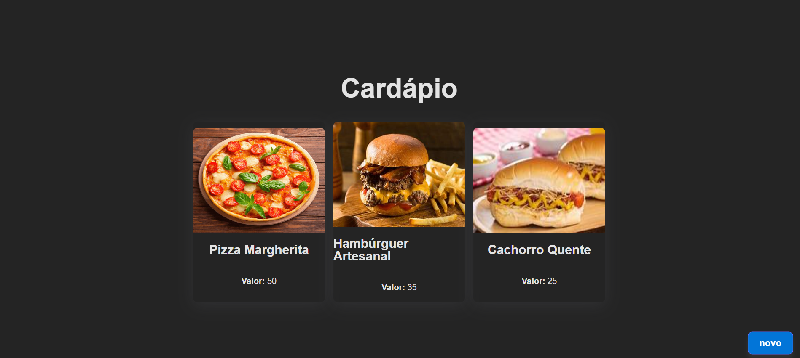
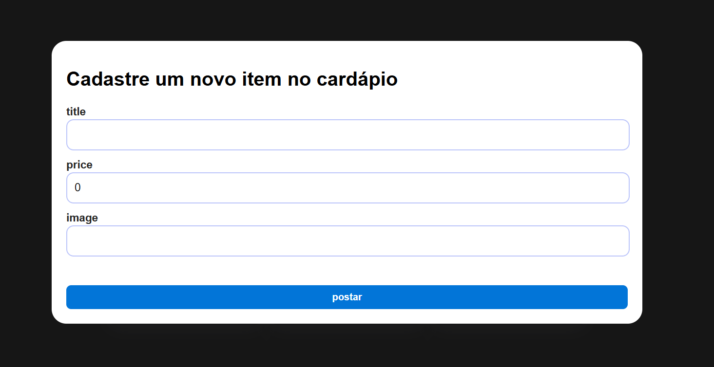

# 🍽️ Cardápio Digital

Uma aplicação fullstack desenvolvida com **React + Vite + TypeScript** no frontend e **Spring Boot + PostgreSQL** no backend. O projeto simula um sistema de cardápio, permitindo cadastrar e visualizar itens com nome, imagem e valor.

---

## 📸 Layout da Página

### 💻 Tela Principal

A interface exibe os produtos cadastrados em cards responsivos:




Cada card mostra:

* 📷 Imagem
* 📝 Nome do prato
* 💰 Preço

O botão **"novo"** abre um modal para cadastro de um novo item.

---

## ⚙️ Tecnologias Utilizadas

### 🔹 Frontend

* React + Vite
* TypeScript
* Axios
* React Query (TanStack)
* CSS Modules

### 🔸 Backend

* Spring Boot
* Spring Data JPA
* Hibernate
* PostgreSQL

---

## 🚀 Como Executar o Projeto

### ✅ Pré-requisitos

* Node.js
* Java 17+
* PostgreSQL

### 📁 Clonando o repositório

```bash
git clone https://github.com/lucaslucena-la/Cardapio.git
cd cardapio-digital
```

### 1⃣ Rodando o Backend

```bash
cd backend
./mvnw spring-boot:run
```

📌 Configure o `application.properties`:

```properties
spring.datasource.url=jdbc:postgresql://localhost:5432/cardapio
spring.datasource.username=seu_usuario
spring.datasource.password=sua_senha
spring.jpa.hibernate.ddl-auto=update
```

---

### 2⃣ Rodando o Frontend

```bash
cd frontend
npm install
npm run dev
```

Acesse: [http://localhost:5173](http://localhost:5173)

---

## 📦 Funcionalidades

* ✅ Listar pratos cadastrados
* ✅ Cadastrar novo item via modal
* ✅ Integração com backend (POST + GET)
* 📷 Imagem dinâmica via URL
* 🔁 Atualização automática com React Query

---


## 📌 Observações

* O campo `image` precisa receber uma URL válida de imagem (JPG/PNG).
* O tamanho máximo permitido para os campos no banco é `varchar(255)` (evite colar URLs longas demais).


---

## ✍️ Autor

Desenvolvido por: Lucas Lucena
GitHub: https://github.com/lucaslucena-la 💻✨
Projeto para prática de integração fullstack moderna com boas práticas

---

## 📜 Licença

Distribuído sob a licença MIT.
